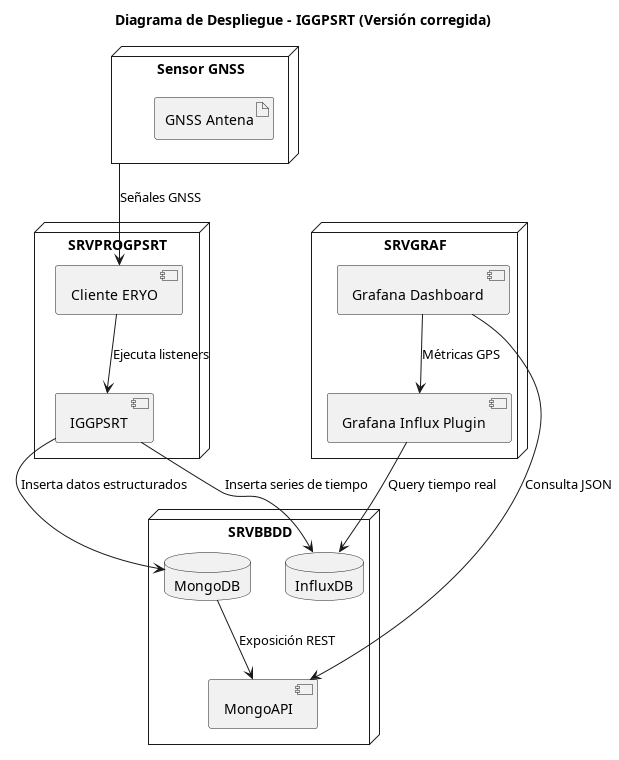

# Mongo API Service

Servicio Flask para exponer datos desde MongoDB usando configuración externa y modular.

## Estructura

- `main.py`: Entrada principal
- `src/api_service.py`: Rutas Flask
- `src/db_connection.py`: Cliente MongoDB
- `src/config_loader.py`: Carga de configuración
- `config/config.yaml`: Configuración principal
- `config/mongo_config.json`: Credenciales de conexión

## Uso

```bash
pip install -r requirements.txt
python main.py
```

# Mongo API para Grafana (con Infinity Plugin)

## 📌 Descripción

Este proyecto es una API REST minimalista diseñada para exponer datos almacenados en una base de datos **MongoDB**, con el objetivo de hacerlos accesibles desde **Grafana** utilizando el plugin **Infinity**.

Grafana en su versión open source **no ofrece soporte nativo para MongoDB**, por lo que esta API actúa como un puente que permite visualizar los datos almacenados —como registros GPS— de forma dinámica y en tiempo real, directamente desde paneles de Grafana.

## 🎯 Objetivos del proyecto

- Evitar depender de la versión Enterprise de Grafana para conectar con MongoDB.
- Exponer endpoints compatibles con el plugin **Infinity**.
- Servir como backend liviano para consultar datos geoespaciales o series temporales (ej. datos GPS).
- Funcionar como prototipo para visualización de datos científicos o técnicos.

## 👥 Público objetivo

- Usuarios técnicos o científicos que trabajan con bases MongoDB y desean visualizar datos en **Grafana open source**.
- Administradores o desarrolladores que ya emplean **InfluxDB** y quieren mantener una base paralela en MongoDB.
- Casos de uso internos en entornos controlados (sin requerimientos de autenticación externa por el momento).

## ⚙️ Requisitos

- Python 3.8 o superior
- MongoDB (en ejecución local o remota)
- Variables de entorno definidas en un archivo `.env`

## 🚀 Instalación

1. Clona el repositorio:

   ```bash
   git clone https://github.com/awacero/mongo_api.git
   cd mongo_api
   ```

2. Instala las dependencias:

   ```bash
   pip install -r requirements.txt
   ```

3. Crea un archivo `.env` basado en `.env.example`:

   ```bash
   cp .env.example .env
   ```

4. Ejecuta la API:

   ```bash
   uvicorn main:app --reload
   ```

## 🔌 Endpoints

### `GET /data`

Obtiene datos desde MongoDB según filtros por fecha u otros parámetros.

#### Parámetros comunes:

- `start`: fecha inicial en formato ISO
- `end`: fecha final en formato ISO
- `station`: nombre de la estación GPS (opcional)
- `limit`: número máximo de resultados (opcional)

#### Ejemplo de uso con `curl`:

```bash
curl "http://localhost:8000/data?start=2023-01-01&end=2023-01-10"
```

## 📊 Uso con Grafana (Infinity Plugin)

1. Agrega una nueva fuente de datos tipo **JSON/REST API (Infinity)**.
2. Configura la URL de esta API (`http://<tu_servidor>:8000/data`)
3. Usa modo `JSON` y selecciona el campo raíz adecuado.
4. Puedes usar filtros en la URL para mostrar datos por fechas.

## 🧪 Pruebas

Pendiente de implementar.

> Se planea usar `pytest` para validar la API en próximas versiones.

## 🔒 Seguridad

Este proyecto es de uso interno. En futuras versiones se considera:

- Soporte para tokens de autenticación (JWT)
- Control de acceso por IP
- Rate limiting

## 🛤️ Roadmap

- [ ] Agregar pruebas automatizadas
- [ ] Validar parámetros de entrada
- [ ] Mejorar documentación Swagger
- [ ] Crear docker-compose para despliegue
- [ ] Implementar filtros avanzados por campos

## 🤝 Contribuciones

¡Las contribuciones son bienvenidas! Si deseas colaborar:

1. Haz un fork del repositorio
2. Crea una rama (`feature/nueva-funcionalidad`)
3. Envía un pull request explicando tu aporte

## 📝 Licencia

Este proyecto se publica bajo la licencia MIT.


## UML Diagram


